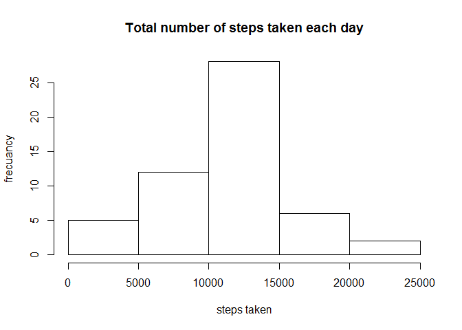
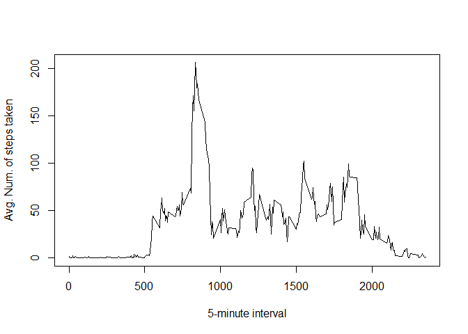
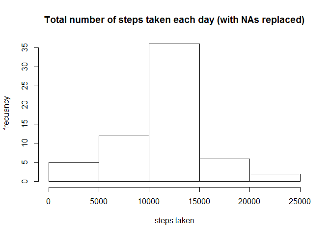
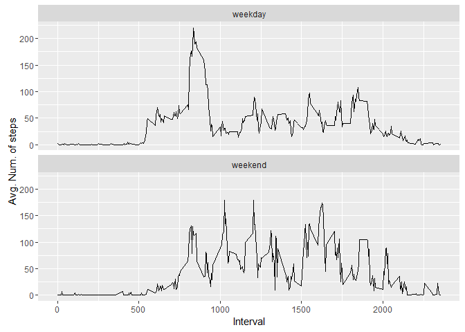

# Reproducible Research: Peer Assessment 1


```r
knitr::opts_chunk$set(echo = TRUE)
```

## Loading and preprocessing the data

Loading the data into de "data" variable:

```r
data <- read.table(unz("activity.zip", "activity.csv"),header = T, sep = ",")
#summary(data)
```

## What is mean total number of steps taken per day?

1. Making the histogram:

```r
frec <- aggregate(data$steps, by=list(date=as.Date(data$date)), FUN=sum)
hist(frec$x,main = "Total number of steps taken each day", xlab = "steps taken", ylab = "frecuancy")
```

<!-- -->

2. Mean and Median number of steps per day:

```r
meanSteps <- mean(frec$x, na.rm = TRUE)
meanSteps
```

```
## [1] 10766.19
```

```r
medianSteps <- median(frec$x, na.rm = TRUE)
medianSteps
```

```
## [1] 10765
```

The mean number of steps is 1.0766189\times 10^{4} and the median number of steps is 10765

## What is the average daily activity pattern?

1. Time series plot of the 5-minute interval average number of steps taken, averaged across all days:

```r
avgSteps <- aggregate(data$steps, by=list(interval=data$interval), FUN=mean, na.rm = TRUE)
plot(avgSteps, type = "l", xlab = "5-minute interval", ylab = "Avg. Num. of steps taken")
```

<!-- -->

2. 5-minute interval containing the maximum number of steps on average:

```r
subset(avgSteps, x==max(avgSteps$x))$interval
```

```
## [1] 835
```

## Imputing missing values

1. Total number of rows with NAs:

```r
sum(is.na(data))
```

```
## [1] 2304
```

2. Strategy for filling in all of the missing values in the dataset:

```
The strategy is to use the mean for the 5-minute interval for replacing the NAs values.
```

3. Creation of a new dataset equal to the original dataset but with the missing data filled in:


```r
data2 <- data
for (i in 1:nrow(data2)) {
  if (is.na(data2$steps[i])) {
    data2$steps[i] <- avgSteps[avgSteps$interval == data2$interval[i],]$x
  }
}
```

4. Make a histogram of the total number of steps taken each day, and calculated **mean** and **median** total number of steps taken per day with the NAs replaced as explained avobe:


```r
frec2 <- aggregate(data2$steps, by=list(date=as.Date(data2$date)), FUN=sum)
hist(frec2$x,main = "Total number of steps taken each day (with NAs replaced)", xlab = "steps taken", ylab = "frecuancy")
```

<!-- -->

```r
meanSteps2 <- mean(frec2$x, na.rm = TRUE)
meanSteps2
```

```
## [1] 10766.19
```

```r
medianSteps2 <- median(frec2$x, na.rm = TRUE)
medianSteps2
```

```
## [1] 10766.19
```
The mean number of steps is 1.0766189\times 10^{4} and the median number of steps is 1.0766189\times 10^{4}

By removing the NAs we notice that both the mean and the median are now the same.
 
## Are there differences in activity patterns between weekdays and weekends?

1. Create a new factor variable in the dataset with two levels -- "weekday" and "weekend" indicating whether a given date is a weekday or weekend day.


```r
data2['dayType'] <- weekdays(as.Date(data2$date))
data2$dayType[data2$dayType  %in% c('sabado','domingo') ] <- "weekend"
data2$dayType[data2$dayType != "weekend"] <- "weekday"
data2$dayType <- as.factor(data2$dayType)
```

1. Make a panel plot containing a time series plot (i.e. `type = "l"`) of the 5-minute interval and the average number of steps taken, averaged across all weekday days or weekend days: 


```r
library(ggplot2)
avgSteps2 <- aggregate(data2$steps, by=list(interval=data2$interval, dayType=data2$dayType), FUN=mean, na.rm = TRUE)
qplot(interval, x, data=avgSteps2, geom=c("line"), xlab="Interval", 
      ylab="Avg. Num. of steps") + facet_wrap( ~ dayType, ncol=1)
```

<!-- -->
